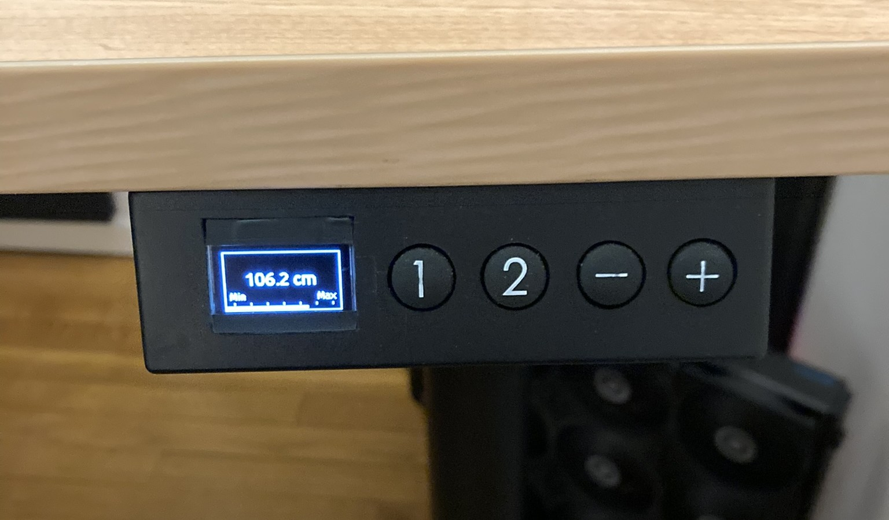
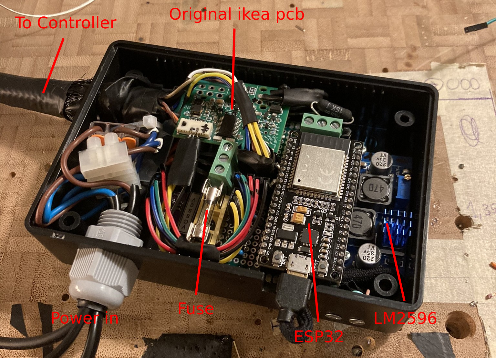

# IKEA-bekant-motorized-desk (hack?)
Basically emulates the original `up`/`down` buttons with optocouplers.   
A time-of-flight (VL53L0X) sensor is used for getting the exact height of the desk.   
And an SSD1306 oled display.

## Features
- Save two different heights on buttons `1` and `2`.
- Control the table normally with the `+` and `-` buttons.
  
&nbsp;
## Hardware  

### Controller/UI

&nbsp;

### Main unit, mounted below the desk

&nbsp;
