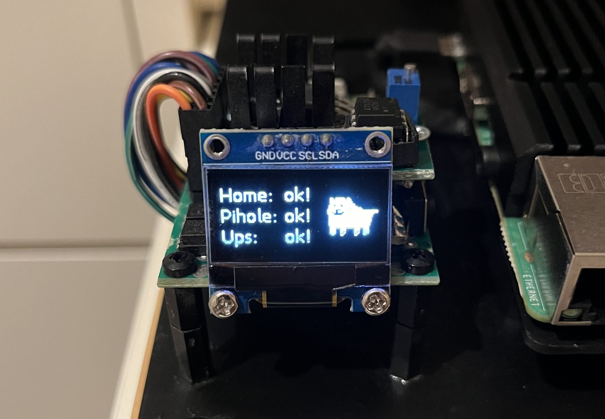

# rpi-watchdog-ups
- Monitors Raspberry Pis by listening to their GPIO pins, via optocouplers.
- Monitors for power outages using a hall effect current sensor.  
- If there's a longer power outage, the watchdog will safely shut down all the Pis and send a status email.
- If one or more of the Pis fails, the watchdog sends a status email. 

&nbsp;
## Hardware
 
&nbsp;
